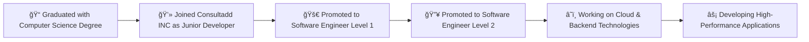

<h1 align="center">Hi, I'm Sandeep Makwana! </h1>

  &nbsp;
  &nbsp;
  

---

### 👨‍💻 &nbsp;About Me

I am a passionate Software Developer from India 🇮🇳, specializing in backend development, cloud computing, and scalable solutions. With over 3 years of hands-on experience, I have contributed to diverse projects, delivering high-quality software.

- 💼 Software Engineer Level 2 at **Consultadd INC**.
- 🌱 Currently exploring **Technical Content Writing** and sharing insights about programming.
- 🚀 Always learning about new technologies and solving challenging problems.
- 🧩 In my free time, I contribute to **open-source projects**, solve problems on **LeetCode**, and read technical blogs.
- 💬 Ask me about **Python, Java, AWS**, or **Web Development**.

Feel free to connect with me on [LinkedIn](https://www.linkedin.com/in/sandeepmakwana) or reach out via [email](mailto:sandeep@example.com) if you'd like to collaborate on a project.

---

### 🛠 &nbsp;Languages and Tools
  <table align="left">
    <tr>
      <td>
        
      </td>
      <td>
        
      </td>
      <td>
        
      </td>
      <td>
        
      </td>
      <td>
        
      </td>
      <td>
        
      </td>
      <td>
        
      </td>
      <td>
        
      </td>
      <td>
        
      </td>
    </tr>
    <tr>
      <td>
        
      </td>
      <td>
        
      </td>
      <td>
        
      </td>
      <td>
        
      </td>
      <td>
        
      </td>
      <td>
        
      </td>
      <td>
        
      </td>
      <td>
        
      </td>
      <td>
        
      </td>
    </tr>
  </table>
      

---

### 🧑‍💼 &nbsp;My Projects

Here are some of the projects I’ve worked on recently:

- **[Project Name 1](https://github.com/isandeepMakwana/project-1)** - Description of the project highlighting the tech stack and the purpose.
- **[Project Name 2](https://github.com/isandeepMakwana/project-2)** - Another significant project, discussing the challenges and solutions.
- **[Project Name 3](https://github.com/isandeepMakwana/project-3)** - Highlight how this project reflects your development skills and problem-solving abilities.

---

## 🔥 My GitHub Stats:

  
    

---

## 🛠 &nbsp;Career Pipeline:

---

### 🤝 &nbsp;Let's Connect

- 💬 I'm always open to discussing new ideas, contributing to interesting projects, or simply talking tech. Feel free to connect with me via [LinkedIn](https://www.linkedin.com/in/sandeepmakwana) or send me an [email](mailto:isandeepmakwana1@gmail.com).

<!-- &nbsp; | &nbsp;
  &nbsp; | &nbsp;
  &nbsp; | &nbsp;
  &nbsp;  | &nbsp;
   &nbsp; | &nbsp;
  &nbsp; | &nbsp;
  &nbsp; | &nbsp;
   &nbsp; | &nbsp;
  ) --!>
